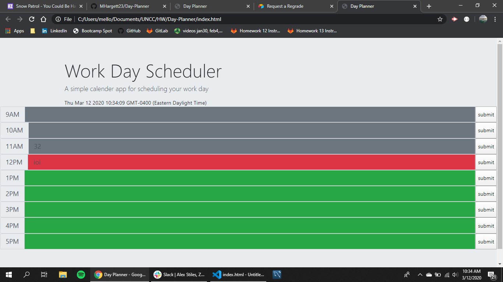

# Day Planner 

### User Story  
AS AN employee with a busy schedule  
I WANT to add important events to a daily planner  
SO THAT I can manage my time effectively  

### Business Context  
Poor time management can result in missed meetings and deadlines or create the appearance of unprofessionalism.  
A daily planner allows employees to see their day at a glance, schedule time effectively, and improve productivity.

### Description
A simple calendar application that allows the user to save events for each hour of the day.  
This app will run in the browser and feature dynamically updated HTML and CSS powered by jQuery.  
The app should display standard business hours (9 a.m. to 5 p.m.).  
Each time slot should represent one hour and contain the following:
<ul><li>The time</li>  
<li>A field to hold user input</li>  
<li>A save button  </li></ul>  

### Requirements  
GIVEN that an employee adds events to a specific hour in a calendar  
WHEN the employee clicks the save button  
THEN events are saved in the timeblock for that hour  

### Link
[Visit this website](https://mhargett23.github.io/Day-Planner/)

### Screenshot
